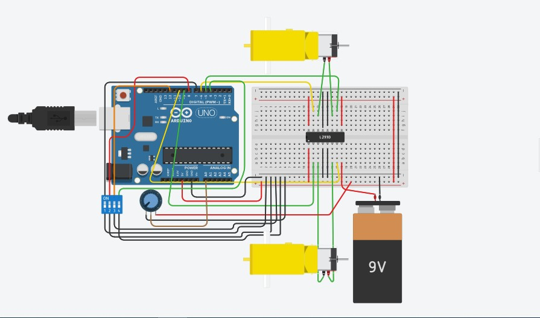

##### My code implements control of generic  pair of wheels by using a potentiometer, and a 4 switch dip switch package. 
##### My design can turn both wheels forward (by controlling the two associated motors ), backwards, turn right (turning right wheel backwards, and  left one forwards), and turn left (turning left wheel backwards, and  right forwards).  Left and right wheels are controlled by the top and bottom motors respectively. 
##### Furthermore, a potentiometer controls the speed of both motors.

### The implemented circuit

